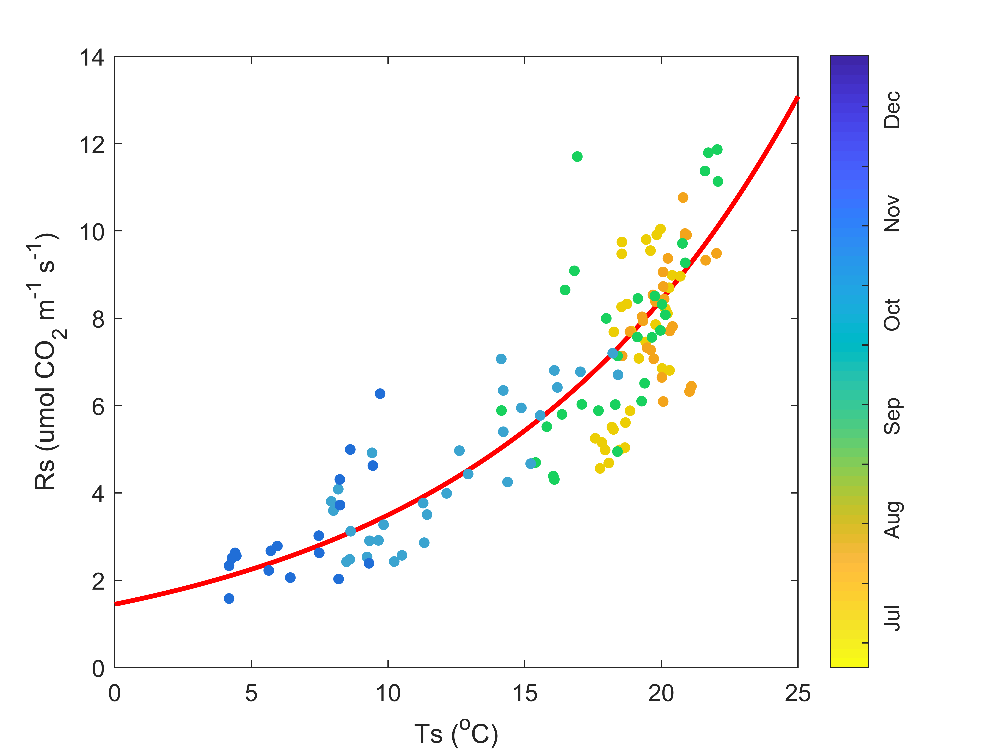

```{r setup, include=FALSE}
knitr::opts_chunk$set(echo = TRUE)
```

# Main Research interest

The main focus of my research is the study of soil respiration within a deciduous and coniferous forest stand through long – term automatic chambers. Then I compare and contrast different models such as the Q<sub>10</sub> model and neural networks to fit the data in order to obtain missing carbon fluxes from periods with no measurement data. 

# Favourites 

## Favourite Music
1. White Flag
2. Don't overthink it
3. Shatter me
4. Godless
5. Hydrogen

## Favourite Equation
y<sub>i</sub> = e<sup>$\beta$<sub>0</sub>+$\beta$<sub>11</sub>T<sub>i</sub>+$\beta$<sub>12</sub>T<sub>i</sub><sup>2</sup>+$\beta$<sub>21</sub>M<sub>i</sub>+$\beta$<sub>22</sub>ln(M<sub>i</sub>)</sup>

## Favourite Artists  
| Name    | Achievements |
|-------- |------------ |
| Andy Warhol | Promotion of art |
| Pablo Picasso| Cubism |
| Lenonardo da Vinci | Designs for technologies |
| Yayoi Kusama | Vivid paintings |
| Titian | Landscape and mystical objects | 

# A Chunk of Code
```{r}
#import data from excel
library(readxl)
Obs_Ts_2018 <- read_excel("E:/Insync/Classes/Geo - 712/Projects/Week 2/Homework/Obs_Ts_2018.xlsx")
#plot this data
plot(Obs_Ts_2018$Ts,Obs_Ts_2018$Obs,main = "Observed soil respiration vs. soil temperature in 2018",xlab = "Ts",ylab = "Rs")
```

# What the final result should look like (image made in matlab)
## In fact, there's a feature called a "live script" within matlab that can do exactly what markdown can do. 



Here is me testing out a change which I can push out to github on the main page. 
